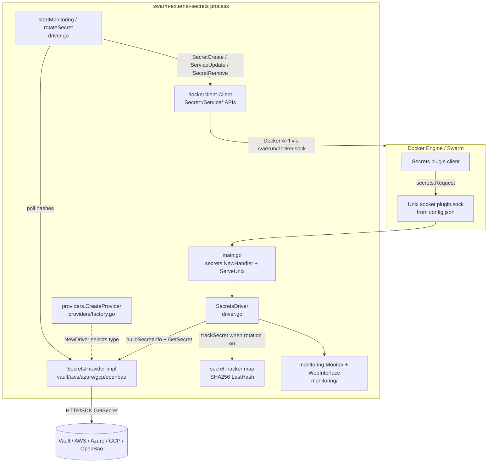
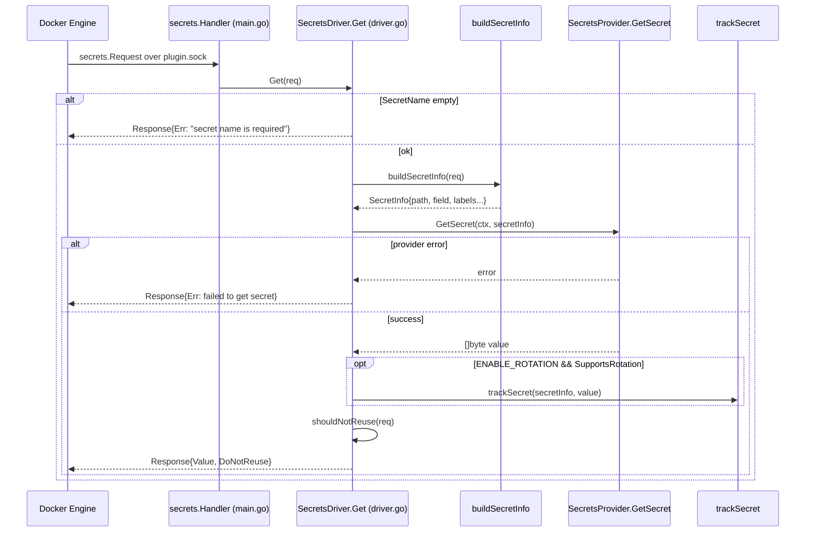
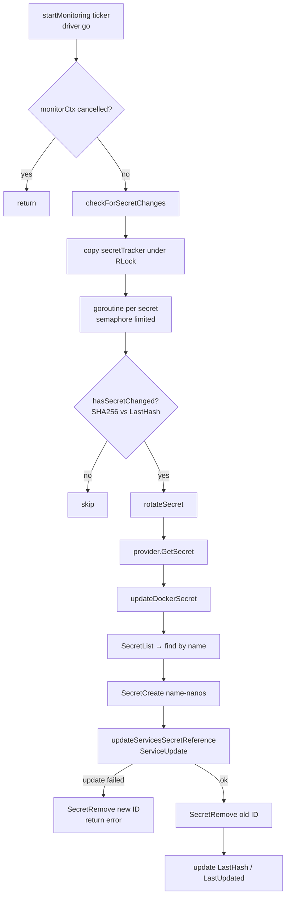

# Onboarding to Swarm External Secrets

This document is for someone who just cloned the repo and wants to understand the system before their first PR — not an API reference, and not a restatement of the README. It walks through what the project actually is, how a secret request travels through the code, where the important abstractions live, and what you should know before you change anything.

---

## What This Project Actually Is

Docker Swarm can store secrets, but those secrets are native to Swarm: you create them with `docker secret create`, and they live inside the cluster. Many teams already keep passwords, tokens, and certificates in an external store — HashiCorp Vault, AWS Secrets Manager, Azure Key Vault, OpenBao, or GCP Secret Manager. Swarm External Secrets is a **Docker secrets plugin** that sits between Swarm and those backends so that when a service asks Swarm for a secret, the value is fetched from the external store instead of being baked into Swarm ahead of time.

The day-to-day unit of work looks like this: an operator declares a Swarm secret with `driver: swarm-external-secrets:latest` and a few provider-specific labels (for Vault, something like `vault_path` and `vault_field`). When a service that references that secret starts, the Docker Engine calls this plugin over a Unix socket. The plugin translates the request into a provider call, returns the bytes, and optionally remembers the secret so a background loop can rotate it later if the backend value changes.

The process is a single Go binary packaged as a Docker plugin (`config.json` + rootfs). It is not a sidecar per service and not a Kubernetes controller. Everything interesting happens inside one long-lived plugin process that Docker loads once and talks to over `plugin.sock`.

---

## Where It's Used, and By Whom

The project lives under [sugar-org/swarm-external-secrets](https://github.com/sugar-org/swarm-external-secrets), is licensed BSD-3-Clause, and is incubated for Google Summer of Code 2026 under [OpenScienceLabs](http://opensciencelabs.org/). There is no `ADOPTERS.md` or public production case-study list in the repo, so treat adoption claims carefully: from available sources, this is an active open-source / GSoC project rather than a widely documented production standard.

Development is GitHub-centered. Discussion also happens on Discord (linked from the README). Commit history shows a small, active contributor group — primarily Atharva Mhaske and Sai Sanjay among others — with recent work focused on multi-provider edge translation, custom Vault/OpenBao mounts, host-mounted logging, parallel rotation polling, and release automation. Published docs are at [sugar-org.github.io/swarm-external-secrets](https://sugar-org.github.io/swarm-external-secrets/).

---

## Tech Stack

The plugin is written in **Go 1.24.2** (`go.mod`). That choice fits the problem: Docker’s plugin helper libraries are Go-native, and the rotation path leans on goroutines — one ticker loop plus concurrent secret checks — without needing a heavier concurrency runtime.

The integration surface with Docker is **`github.com/docker/go-plugins-helpers/secrets`**. That package defines the secrets driver protocol: you implement `Get(secrets.Request) secrets.Response`, wrap the driver with `secrets.NewHandler`, and serve a Unix socket with `ServeUnix`. Swarm External Secrets does exactly that in `main.go`. For rotation — creating new secret versions and rewriting service specs — the plugin uses the full **Docker Engine API client** (`github.com/docker/docker`), because the plugin protocol alone cannot mutate Swarm secrets or services.

Each cloud/backend SDK is used only inside its provider file: Vault API, OpenBao API v2, AWS SDK v2 Secrets Manager, Azure Key Vault secrets SDK, and GCP Secret Manager. Logging is **logrus** throughout. Observability is in-process: a small HTTP dashboard and Prometheus-text metrics in the `monitoring/` package, not an external agent.

Docs are MkDocs Material; contributor tasks go through Makim (`.makim.yaml`); hooks use Lefthook + golangci-lint. Releases use GoReleaser for Linux binaries, and CI smoke-tests the plugin against real backends in containers.

---

## Libraries and Why They're Here

Grouped by the job they do, not by `go.mod` order:

**Talking to Docker as a plugin.** `github.com/docker/go-plugins-helpers` is non-negotiable for this project’s identity: without it you are not a Swarm secrets driver. You’ll see `secrets.Request` / `secrets.Response` at the edge of `driver.go` and in every provider’s `BuildSecretPath`.

**Mutating Swarm state for rotation.** `github.com/docker/docker` shows up almost entirely in `driver.go` — `SecretList`, `SecretCreate`, `SecretRemove`, `ServiceList`, `ServiceUpdate`. The plugin mounts the host Docker socket (`config.json`) so those calls can reach the Engine.

**Fetching secrets from backends.** Each provider SDK is isolated:
- `hashicorp/vault/api` in `providers/vault.go` (Logical reads + AppRole)
- `openbao/openbao/api/v2` in `providers/openbao.go` (Vault-compatible, separate client)
- `aws-sdk-go-v2` (+ secretsmanager) in `providers/aws.go`
- Azure `azsecrets` / `azidentity` in `providers/azure.go`
- `cloud.google.com/go/secretmanager` in `providers/gcp.go`

**Shared plumbing.** `sirupsen/logrus` is the logging backbone; `internal/logging` adds file rotation to a host-mounted path so you can tail logs from outside the plugin rootfs. Field extraction helpers in `providers/common.go` exist so JSON-vs-string secret payloads don’t get reimplemented five times.

Trivial tooling deps (linters, formatters) are skipped here — see `.golangci.yml` and `lefthook.yml` if you care about the CI hygiene stack.

---

## Core Architecture

Three ideas make the rest of the codebase click. Learn these before you wander the tree.

### 1. The Docker secrets plugin edge

Docker Engine does not import this repo. It loads a plugin described by `config.json`, connects to a Unix socket named `plugin.sock`, and calls the secrets driver protocol. `main.go` builds a `SecretsDriver`, wraps it with `secrets.NewHandler(driver)`, and serves that socket. Your first mental model should be: **Swarm → Unix socket → `SecretsDriver.Get`**.

### 2. `SecretsProvider` as the only backend boundary

All backends implement `providers.SecretsProvider` in `providers/interface.go`: `Initialize`, `GetSecret`, `SupportsRotation`, `GetSecretFieldLabel`, `BuildSecretPath`, `GetProviderName`, `Close`. The driver never branches on “are we talking to Vault or AWS?” for the happy path — it asks the interface. `providers.CreateProvider` in `factory.go` is the only switch that picks a concrete type from `SECRETS_PROVIDER`.

### 3. Edge translation into `SecretInfo`

Docker’s `secrets.Request` is an awkward shape for rotation (labels, service name, secret name). PR #147 made the rule explicit: translate once at the edge via `buildSecretInfo`, then pass `*providers.SecretInfo` everywhere downstream — fetch, track, hash-compare, rotate. If you add a label or path convention, that translation function is where it belongs.

Around those three ideas sit optional subsystems: a rotation ticker (`startMonitoring` → `checkForSecretChanges` → `rotateSecret` → `updateDockerSecret`), and a monitoring HTTP UI (`monitoring.Monitor` + `WebInterface`).

### Architecture Diagram



---

## How Data/Requests Actually Flow Through the System

### Flow A — Swarm asks for a secret (`Get`)

When a task needs a secret, Docker calls `SecretsDriver.Get` in `driver.go`. The driver rejects an empty `SecretName`, then builds a `SecretInfo` once: the field comes from the provider’s field label (e.g. `vault_field`, defaulting to `"value"`), and the path comes from `provider.BuildSecretPath(req)`. It then calls `provider.GetSecret` with a 30-second context timeout.

On success, if rotation is enabled and the provider supports it, `trackSecret` stores the secret under `secretTracker` keyed by Docker secret name, with a SHA256 of the value as `LastHash`. Finally `shouldNotReuse` maps the `secret_reuse` label (and name heuristics) onto Docker’s `DoNotReuse` flag — when `DoNotReuse` is true, Swarm should not cache/reuse a stale value.

Error paths return `secrets.Response{Err: ...}` without tracking. Provider failures are logged with the provider name and secret name so operators can tell “plugin up, backend down” from “plugin misconfigured.”

### Flow Diagram — Get path



### Flow B — Background rotation

If `ENABLE_ROTATION=true` and `SupportsRotation()` is true, `NewDriver` starts `go driver.startMonitoring()`. That loop ticks on `ROTATION_INTERVAL` (default `10s`), updates the monitor heartbeat, and calls `checkForSecretChanges`. Checks run concurrently (semaphore sized to the tracker). Each check re-fetches via `GetSecret` and compares SHA256 hashes in `hasSecretChanged`.

On change, `rotateSecret` fetches again, then `updateDockerSecret`:
1. `SecretList` to find the current secret by name
2. `SecretCreate` a versioned name `{name}-{unixnano}` with the new bytes
3. `updateServicesSecretReference` → `buildUpdatedSecretReferences` → `applyServiceSecretUpdate` (`ServiceUpdate`, plus a rotation label)
4. `SecretRemove` the old secret ID (best-effort if remove fails after services already moved)

If service update fails, the newly created secret is cleaned up so you don’t accumulate orphans. Metrics counters (`IncrementSecretRotations` / `IncrementRotationErrors`) update when monitoring is enabled.

### Flow Diagram — Rotation path



---

## Repository Layout — What Lives Where

This is the real tree as of the current checkout. `CONTRIBUTING.md` still mentions older paths like `providers/vault/` and a root `utils.go` — prefer this map.

```
.
├── main.go                 # Process entry: flags, logging, NewDriver, ServeUnix
├── driver.go               # SecretsDriver: Get, tracking, rotation, Swarm updates
├── driver_test.go          # Unit tests for buildUpdatedSecretReferences
├── config.json             # Docker plugin manifest (socket, mounts, settable env)
├── go.mod / go.sum         # Module github.com/sugar-org/swarm-external-secrets
├── Dockerfile              # Multi-stage binary → alpine plugin rootfs source
├── docker-compose.yml      # Demo Swarm stack consuming plugin-backed secrets
├── docker-compose.logs.yml # Sidecar that tails host-mounted plugin.log
├── readme.md               # Product overview / install
├── CONTRIBUTING.md         # Contributor + GSoC guide (verify structure claims!)
├── mkdocs.yml              # Docs site
├── .makim.yaml             # Task runner → scripts/*
├── lefthook.yml / setup-hooks.sh
├── providers/              # SecretsProvider implementations + factory
│   ├── interface.go        # SecretsProvider, SecretInfo
│   ├── factory.go          # CreateProvider switch
│   ├── common.go           # ExtractSecretValue* helpers
│   └── vault|openbao|aws|azure|gcp.go
├── monitoring/             # In-process metrics + HTTP dashboard
├── internal/
│   ├── logging/            # File logging via PLUGIN_LOG_PATH
│   ├── kvpath/             # Vault/OpenBao KV v2 path builders
│   └── utils/              # Env/duration/port helpers
├── scripts/                # build, deploy, smoke tests, demo-rotation
│   └── tests/              # E2E smoke against Vault/OpenBao/LocalStack
├── vault_conf/             # Sample Vault HCL policies
├── docs/                   # MkDocs sources (rotation, multi-provider, gcp, …)
└── .github/workflows/      # smoke-tests, release, vet, scorecard, gh-pages
```

If you are extending backends, you will spend most of your time in `providers/` and then register a case in `factory.go`. If you are changing how Swarm secrets get rewritten on rotation, stay in `driver.go` — especially `updateDockerSecret` and `buildUpdatedSecretReferences`. Operator-facing env knobs almost always need a matching entry in `config.json`’s settable `env` list or the plugin will not accept `docker plugin set`.

---

## What You Should Know Before You Start

These are prerequisites specific to *this* codebase, not generic “know Git” advice:

**Docker Swarm secrets plugin protocol.** You should understand that Swarm secrets drivers are Unix-socket plugins implementing a small RPC surface (`Get`), and that `DoNotReuse` controls caching. Without that, `main.go` and `shouldNotReuse` look like unexplained ceremony.

**Swarm secrets are immutable values with replaceable references.** Docker does not “edit” a secret in place the way Vault does. Rotation in this project works by creating a new secret object and pointing services at the new ID — that is why `updateDockerSecret` looks more like a cutover than an update.

**Provider label contracts.** Each backend has its own path/field labels (`vault_path`/`vault_field`, `aws_secret_name`/`aws_field`, etc.). `BuildSecretPath` and `GetSecretFieldLabel` encode those contracts; breaking them breaks compose files in the wild.

**Vault/OpenBao KV v2 path shapes.** Mount prefixes and the `/data/` segment matter. `internal/kvpath` exists because getting this wrong silently 404s. Read it before touching Vault/OpenBao path code.

**Hash-based change detection.** Rotation does not use Vault’s metadata version API as the primary signal; it re-reads values and compares SHA256. That has latency and consistency implications when you tune `ROTATION_INTERVAL`.

**Plugin packaging vs. normal Go binaries.** Local `go run .` is not how Swarm loads you. You build a rootfs, pair it with `config.json`, and `docker plugin create` / `enable`. Smoke tests in `scripts/tests/` are the realistic confidence gate; unit coverage on providers is thin.

**Docs drift to watch for.** GCP is implemented in `providers/gcp.go` even where older marketing text still says “placeholder.” CONTRIBUTING’s “add a provider” steps still describe a nested package layout that no longer matches. Prefer the code and this document when they disagree.

---

## Getting Your Bearings for a First Contribution

A good first path: run the Vault smoke test (`makim` / `scripts/tests/smoke-test-vault.sh` after Swarm is available), read `Get` + `buildSecretInfo` end to end, then skim one provider file next to `interface.go`. Small, high-value first tasks often live in docs accuracy, smoke coverage for an edge case you already hit, or a narrowly scoped provider bug — not a brand-new backend on day one.

Read `CONTRIBUTING.md` for GSoC norms (small PRs, AI disclosure policy) and use the PR template’s provider/test/AI fields. Prefer `makim ci.all` before opening a PR when your environment can run Docker. Open issues on GitHub and Discord if the architecture diagram in `docs/architecture.png` and this document disagree with something you see in a newer commit — the code wins.
