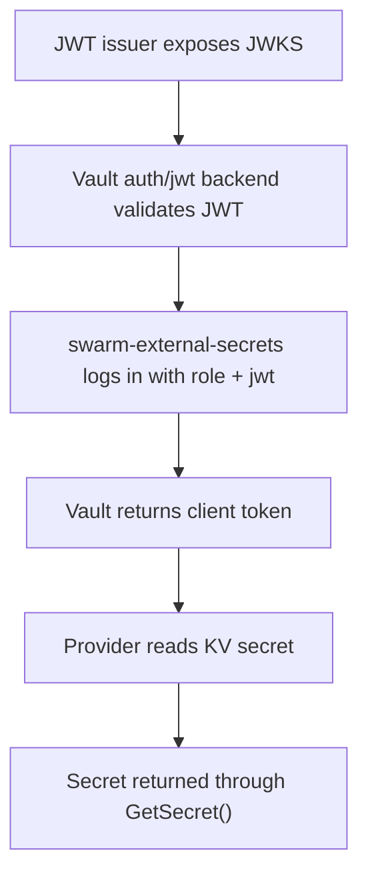

# Vault JWT Auth POC

This proof of concept shows how the plugin can authenticate to HashiCorp Vault without a browser flow and without storing a long-lived Vault token inside the plugin.

## What the POC demonstrates

- Vault JWT auth is enabled and configured with a JWKS-backed verifier.
- A `role_type="jwt"` Vault role binds the expected `aud` claim and policies.
- The plugin uses `VAULT_AUTH_METHOD="jwt"` to log in through `auth/jwt/login`.
- After login, the provider reads a KV secret through the normal `GetSecret()` flow.
- Existing secret lookup, field extraction, and rotation behavior stay unchanged.

## Operator-side Vault setup

The plugin only performs the login step. Vault still needs to be prepared ahead of time using the official JWT auth flow:

1. Enable the auth method:

```bash
vault auth enable jwt
```

2. Configure the backend with a verifier such as `jwks_url`:

```bash
vault write auth/jwt/config \
  jwks_url="https://issuer.example.com/keys" \
  bound_issuer="https://issuer.example.com"
```

3. Create a JWT role bound to the audience your workload presents:

```bash
vault write auth/jwt/role/swarm-plugin \
  role_type="jwt" \
  user_claim="sub" \
  bound_audiences="vault" \
  bound_subject="spiffe://example.org/swarm/plugin/swarm-external-secrets" \
  policies="smoke-policy"
```

4. Store the secret in KV:

```bash
vault kv put secret/database/mysql password="vault-jwt-pass-v1"
```

## Plugin-side configuration

```bash
docker plugin set swarm-external-secrets:latest \
  SECRETS_PROVIDER="vault" \
  VAULT_ADDR="https://vault.example.com:8200" \
  VAULT_AUTH_METHOD="jwt" \
  VAULT_JWT_FILE="/run/swarm-external-secrets/vault-jwt" \
  VAULT_JWT_ROLE="swarm-plugin" \
  VAULT_JWT_AUTH_PATH="jwt"
```

The provider accepts either:

- `VAULT_JWT` for a raw token passed directly to the plugin
- `VAULT_JWT_FILE` for a token written by a helper or workload identity agent

For this POC, the file-based approach is the cleanest non-interactive option because the JWT can be refreshed externally without changing the provider logic.

## Request flow



## Why this fits the current architecture

- The login step changes, but the Vault secret-read path does not.
- The provider still ends with a Vault client token and uses the existing KV lookup flow.
- Rotation support remains unchanged because the provider still hashes the final secret value, not the auth material.
- This keeps the JWT POC small and makes future OIDC or workload-identity extensions easier.

## Current repo status

This branch adds:

- `VAULT_AUTH_METHOD="jwt"`
- `VAULT_JWT`
- `VAULT_JWT_FILE`
- `VAULT_JWT_ROLE`
- `VAULT_JWT_AUTH_PATH`

It also includes a provider test that exercises JWT login followed by a KV secret read, which makes the POC easy to review even before a full end-to-end Vault environment is wired into CI.
